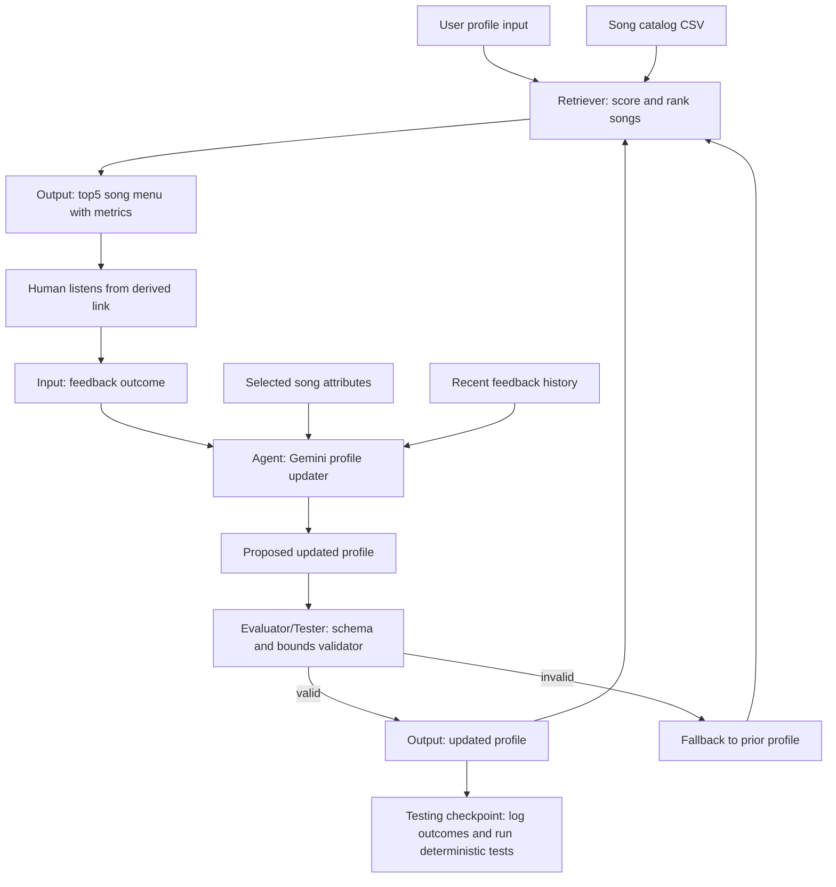

# Agentic Workflow Diagram

```mermaid
flowchart TD
    userInput[User profile input] --> retriever[Retriever: score and rank songs]
    songData[Song catalog CSV] --> retriever
    retriever --> menuOutput[Output: top5 song menu with metrics]
    menuOutput --> humanListen[Human listens from derived link]
    humanListen --> feedbackInput[Input: feedback outcome]
    feedbackInput --> agent[Agent: Gemini profile updater]
    selectedSong[Selected song attributes] --> agent
    sessionHistory[Recent feedback history] --> agent
    agent --> profileDraft[Proposed updated profile]
    profileDraft --> validator[Evaluator/Tester: schema and bounds validator]
    validator -->|valid| updatedProfile[Output: updated profile]
    validator -->|invalid| fallbackProfile[Fallback to prior profile]
    updatedProfile --> retriever
    fallbackProfile --> retriever
    updatedProfile --> testChecks[Testing checkpoint: log outcomes and run deterministic tests]
```
