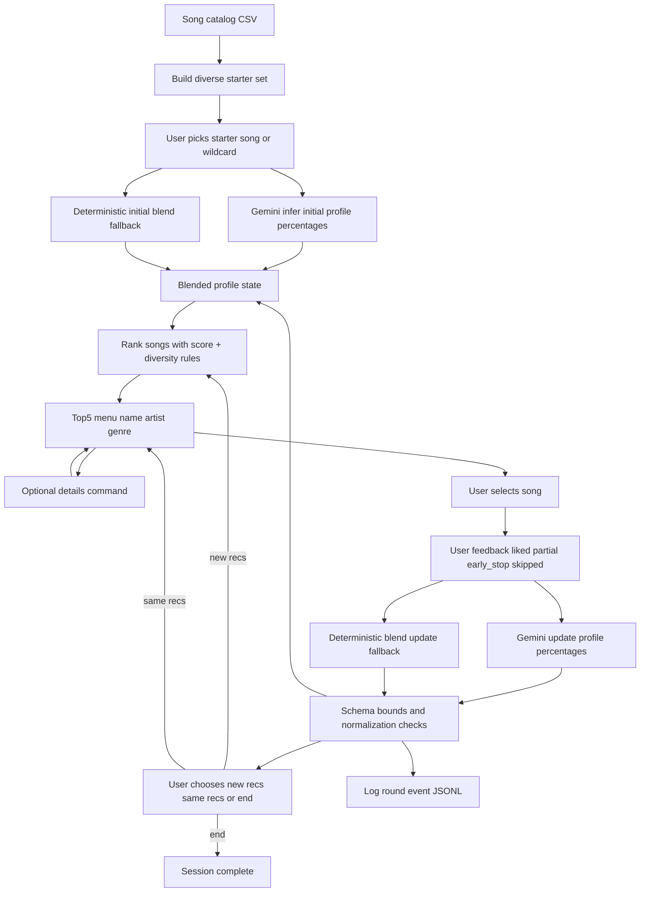

# Agentic Workflow Diagram

```mermaid
flowchart TD
    songData[Song catalog CSV] --> starterSet[Build diverse starter set]
    starterSet --> starterChoice[User picks starter song or wildcard]
    starterChoice --> initAgent[Gemini infer initial profile percentages]
    starterChoice --> initFallback[Deterministic initial blend fallback]
    initAgent --> blendState[Blended profile state]
    initFallback --> blendState

    blendState --> ranker[Rank songs with score + diversity rules]
    ranker --> menu[Top5 menu name artist genre]
    menu --> detailsCmd[Optional details command]
    detailsCmd --> menu
    menu --> songPick[User selects song]
    songPick --> feedback[User feedback liked partial early_stop skipped]

    feedback --> updateAgent[Gemini update profile percentages]
    feedback --> updateFallback[Deterministic blend update fallback]
    updateAgent --> validator[Schema bounds and normalization checks]
    updateFallback --> validator
    validator --> blendState

    validator --> nextStep[User chooses new recs same recs or end]
    nextStep -->|new recs| ranker
    nextStep -->|same recs| menu
    nextStep -->|end| endNode[Session complete]

    validator --> logger[Log round event JSONL]
```
